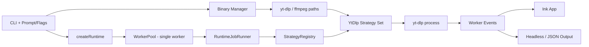

# VIDLER

> Your all-in-one command center for fast, high-quality video downloads.

[](https://www.typescriptlang.org/)
[](https://nodejs.org/)
[](https://github.com/vadimdemedes/ink)
[](./package.json)

```text
__     ___ ____  _     _____ ____
\ \   / (_)  _ \| |   | ____|  _ \
 \ \ / /| | | | | |   |  _| | |_) |
  \ V / | | |_| | |___| |___|  _ <
   \_/  |_|____/|_____|_____|_| \_\
```

## Why VIDLER

- One-link focused UX for v1: fast interactive setup and clear progress.
- Direct `yt-dlp` progress integration for accurate speed, ETA, and percent.
- Live terminal UI with compact status and expandable logs.
- Auto-bootstrap for `yt-dlp` and `ffmpeg` when possible.

## Tech Stack

- Runtime: Node.js (ESM, `>=16`)
- Language: TypeScript
- Terminal UI: Ink + React + `@inkjs/ui`
- CLI parsing: Meow
- Downloader engine: `yt-dlp`
- Media post-processing: `ffmpeg`
- Formatting/Linting: Biome

## V1 Scope

- One URL per run.
- Single worker execution.
- Retry and timeout handled per job.

## Live UI Preview

```text
╭──────────────────────────────────────────────────────────────────────────────╮
│ ◈ Vidler Live                                  ⏱ elapsed 00:23              │
│ q/esc exit | d details | l logs expand/collapse              ▶ running      │
╰──────────────────────────────────────────────────────────────────────────────╯
╭──────────────────────────────────────────────────────────────────────────────╮
│ [▶ YT] job-...                                                   42.3%       │
│ [███████████████████░░░░░░░░░░░░░░░░░░░░░░░░░░]                            │
│ ⇣ Speed 2.1 MB/s | ◌ ETA 00:11 | ⬇ Size 54 MB / 128 MB | ↻ Attempt 1       │
╰──────────────────────────────────────────────────────────────────────────────╯
╭──────────────────────────────────── 📜 Download Logs ────────────────────────╮
│ [system]> exec yt-dlp ...                                                   │
│ [stdout]> [download] ...                                                    │
│ [stderr]> warning/error lines...                                            │
╰──────────────────────────────────────────────────────────────────────────────╯
```

## Quick Start

### 1. Install deps

```bash
pnpm install
```

### 2. Build

```bash
pnpm build
```

Release build (package tarball):

```bash
pnpm release:build
```

## Multi-OS Release Builds

GitHub Actions workflow: `.github/workflows/release-build.yml`

- Triggers on `v*` tags and manual `workflow_dispatch`
- Builds on:
  - `ubuntu-latest`
  - `macos-latest`
  - `windows-latest`
- Produces one artifact per OS:
  - `vidler-Linux.tgz`
  - `vidler-macOS.tgz`
  - `vidler-Windows.tgz`

### 3. Run

Interactive mode:

```bash
node dist/cli.js
```

Direct URL mode:

```bash
node dist/cli.js "https://www.youtube.com/watch?v=dQw4w9WgXcQ"
```

Show live logs in UI:

```bash
node dist/cli.js "https://www.youtube.com/watch?v=dQw4w9WgXcQ" --show-log
```

Headless JSON mode:

```bash
node dist/cli.js "<url>" --json --no-progress
```

Headless mode with raw downloader logs:

```bash
node dist/cli.js "<url>" --no-progress --show-log
```

## CLI Reference

```bash
vidler [url] [options]
```

| Option | Description | Default |
|---|---|---|
| `--quality <value>` | `best`, `worst`, `720p`, `1080p`, ... | `best` |
| `--output <dir>` | Output directory | `./output` |
| `--filename <template>` | Optional output template | auto |
| `--concurrency <n>` | Deprecated in v1 (single worker only) | `1` |
| `--retries <n>` | Retry attempts | `3` |
| `--timeout <sec>` | Per-attempt timeout | unset |
| `--show-log` | Stream yt-dlp/system logs | `false` |
| `--no-progress` | Disable Ink live UI | `false` |
| `--json` | Machine-readable events | `false` |
| `--verbose` | Verbose logs | `false` |

## Runtime Dependencies

- `yt-dlp` is auto-downloaded if missing.
- `ffmpeg` is discovered from PATH first, then auto-downloaded when supported.
- If `ffmpeg` is still unavailable, downloads still work but some merge/container outcomes may differ.

## Keyboard Controls (UI)

- `q` / `esc` / `Ctrl+C`: exit
- `d`: toggle details row
- `l`: expand/collapse logs (when `--show-log` is enabled)

## Architecture



## Exit Codes

- `0` success
- `1` runtime/download error
- `2` invalid input
- `3` dependency/bootstrap failure

## Contributing

- Coding conventions: [`CONTRIBUTING.md`](./CONTRIBUTING.md)
- Agent workflow guide: [`AGENTS.md`](./AGENTS.md)
